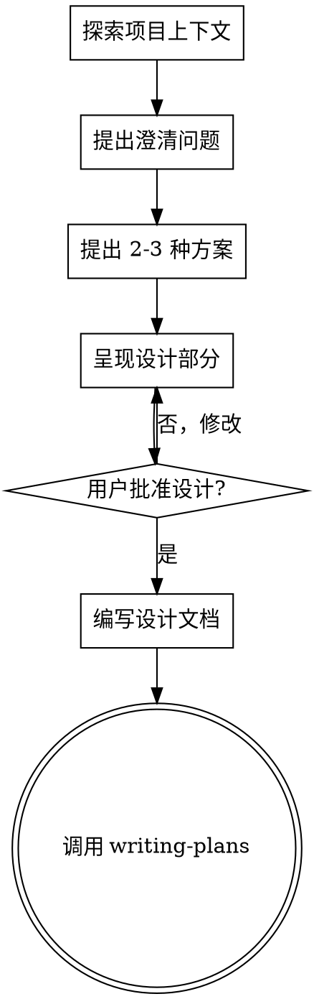

# Supercraft Brainstorming: 将想法转化为设计

## 概述

帮助用户通过自然对话将想法转化为完整的设计和规格。

<HARD-GATE>
在呈现设计并获得用户批准之前，禁止调用任何实现技能、编写代码、搭建项目或采取任何实现行动。无论项目多"简单"，都必须经过此流程。
</HARD-GATE>

## 反模式："这太简单不需要设计"

每个项目都要经过这个过程。待办事项列表、单一功能工具、配置更改——都是如此。"简单"项目正是未经检验的假设导致最多浪费工作的地方。设计可以很短（真正简单的项目几句话就行），但必须呈现并获得批准。

## 检查清单

必须按顺序完成以下每个项目：

1. **探索项目上下文** — 检查文件、文档、最近提交
2. **提出澄清问题** — 一次一个，理解目的/约束/成功标准
3. **提出 2-3 种方案** — 包含权衡和你的推荐
4. **呈现设计** — 按复杂度分部分呈现，每部分后获取用户批准
5. **编写设计文档** — 保存到 `docs/plans/YYYY-MM-DD-<topic>-design.md` 并提交
6. **过渡到实施** — 调用 writing-plans 技能创建实施计划

## 流程图



**最终状态是调用 writing-plans。** 不要调用 frontend-design、mcp-builder 或任何其他实现技能。brainstorming 之后唯一的技能是 writing-plans。

## 工作流程

### 步骤 1: 探索项目上下文

- 检查项目文件结构
- 查看最近提交
- 了解现有架构

### 步骤 2: 提出澄清问题

**一次只问一个问题！** 如果一个主题需要更多探索，将其拆分为多个问题。

**必须使用的提问模式：**

优先使用 AskUserQuestion 工具提供多选题，同时允许用户选择"其他"输入自定义答案。只有在没有合适选项时才使用开放式问题。

**必问问题（根据情况选择）：**

1. **背景**：这个功能的用途是什么？解决什么问题？
2. **用户**：谁会使用这个功能？
3. **约束**：有什么技术限制？需要兼容什么？
4. **成功标准**：怎么算完成？有哪些验收条件？
5. **优先级**：必须要有还是可以有？

### 步骤 3: 提出方案

- 提出 2-3 种不同的方案
- 说明各方案的权衡
- 给出推荐方案和理由
- 会话式呈现，先说推荐再说原因

### 步骤 4: 呈现设计

- 按部分呈现设计
- 复杂度简单的部分几句话，复杂的部分 200-300 字
- 每个部分后确认是否正确
- 覆盖：架构、组件、数据流、错误处理、测试

### 步骤 5: 保存设计文档

- 将设计保存到 `docs/plans/YYYY-MM-DD-<topic>-design.md`
- 提交到 git

## 设计文档结构

```markdown
# [主题] 设计文档

> **创建时间**: YYYY-MM-DD
> **状态**: 草稿/评审中/已批准

## 1. 概述
- 背景
- 目标
- 范围

## 2. 技术方案
- 架构设计
- 组件设计
- 数据流

## 3. API 设计
- 接口定义
- 数据结构

## 4. 测试策略
- 单元测试
- 集成测试

## 5. 实施计划
- 任务分解
- 里程碑
```

## 关键原则

- **一个问题一次** - 不要用多个问题淹没用户
- **多选优先** - 用 AskUserQuestion 提供选项，比开放式问题更容易回答
- **YAGNI** - 只设计需要的功能
- **渐进式验证** - 每个部分后确认
- **保持灵活** - 随时可以回退澄清
- **设计后才能实施** - 未批准设计前不得开始编码
