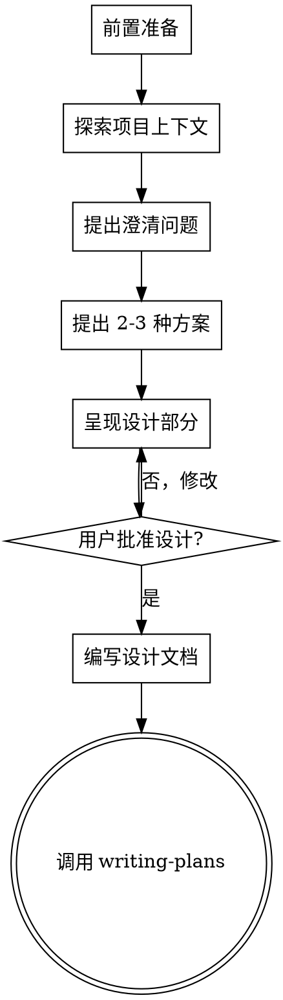

# Supercraft Brainstorming: 将想法转化为设计

## 概述

帮助用户通过自然对话将想法转化为完整的设计和规格。

<HARD-GATE>
在呈现设计并获得用户批准之前，禁止调用任何实现技能、编写代码、搭建项目或采取任何实现行动。无论项目多"简单"，都必须经过此流程。
</HARD-GATE>

## 反模式："这太简单不需要设计"

每个项目都要经过这个过程。待办事项列表、单一功能工具、配置更改——都是如此。"简单"项目正是未经检验的假设导致最多浪费工作的地方。设计可以很短（真正简单的项目几句话就行），但必须呈现并获得批准。

## 检查清单

必须按顺序完成以下每个项目：

0. **前置准备** — 获取规范、选择模板
1. **探索项目上下文** — 检查文件、文档、最近提交
2. **提出澄清问题** — 一次一个，理解目的/约束/成功标准
3. **提出 2-3 种方案** — 包含权衡和你的推荐
4. **呈现设计** — 按复杂度分部分呈现，每部分后获取用户批准
5. **编写设计文档** — 保存到 `docs/plans/YYYY-MM-DD-<topic>-design.md` 并提交
6. **过渡到实施** — 调用 writing-plans 技能创建实施计划

## 流程图



## 工作流程

### 步骤 0: 前置准备

#### 0.1 获取用户规范（如果需要）

询问用户是否需要注入已有的团队规范：

```
使用 AskUserQuestion 询问：
- "需要注入团队编码规范吗？"
- 选项：是 / 否
```

如果用户选择"是"，获取规范：

```bash
supercraft spec list  # 查看可用规范
supercraft spec get <规范名>  # 获取规范内容
```

#### 0.2 选择并创建设计模板

**首先列出可用模板：**

```bash
supercraft template list
```

**必须使用 AskUserQuestion 让用户选择模板：**

```
使用 AskUserQuestion 询问：
- "想用什么模板来组织设计？"
- 选项：从 supercraft template list 的结果中选择
- 如果只有 design-doc，直接使用它
```

根据用户选择复制模板：

```bash
supercraft template copy <选择的模板>
```

**记住用户选择的模板，后续提问和写方案都基于此模板。**

模板内容将指导后续提问的方向。

### 步骤 1: 探索项目上下文

- 检查项目文件结构
- 查看最近提交
- 了解现有架构

### 步骤 2: 提出澄清问题

**一次只问一个问题！** 如果一个主题需要更多探索，将其拆分为多个问题。

**必须使用的提问模式：**

优先使用 AskUserQuestion 工具提供多选题，同时允许用户选择"其他"输入自定义答案。只有在没有合适选项时才使用开放式问题。

**基于用户选择的模板提问：**

根据用户选择的模板，使用该模板中的提问建议。

例如，如果用户选择 design-doc，模板中包含：
- 背景：解决什么问题？谁会遇到这个问题？
- 约束：技术限制？需要兼容什么？
- 成功标准：怎么算完成？验收条件是什么？
- 风险：可能遇到什么问题？

**鼓励根据具体情况发散性地提问：**
- 如果是 API 相关：认证、授权、限流
- 如果是 UI 相关：交互体验、无障碍
- 如果是数据相关：一致性、备份、迁移
- 任何你觉得需要澄清的问题

### 步骤 3: 提出方案

- 提出 2-3 种不同的方案
- 说明各方案的权衡
- 给出推荐方案和理由
- 会话式呈现，先说推荐再说原因

### 步骤 4: 呈现设计

**基于用户选择的模板呈现设计。**

按照模板的结构逐部分呈现：
- 复杂度简单的部分几句话，复杂的部分 200-300 字
- 每个部分后确认是否正确
- 覆盖模板中要求的所有部分

### 步骤 5: 保存设计文档

- 将设计保存到 `docs/plans/YYYY-MM-DD-<topic>-design.md`
- 提交到 git

## 设计文档结构

设计文档的结构由用户选择的模板决定。

复制模板后，模板文件已包含完整的结构框架，直接按照模板填充内容即可。

## 关键原则

- **一个问题一次** - 不要用多个问题淹没用户
- **多选优先** - 用 AskUserQuestion 提供选项，比开放式问题更容易回答
- **YAGNI** - 只设计需要的功能
- **渐进式验证** - 每个部分后确认
- **保持灵活** - 随时可以回退澄清
- **设计后才能实施** - 未批准设计前不得开始编码
